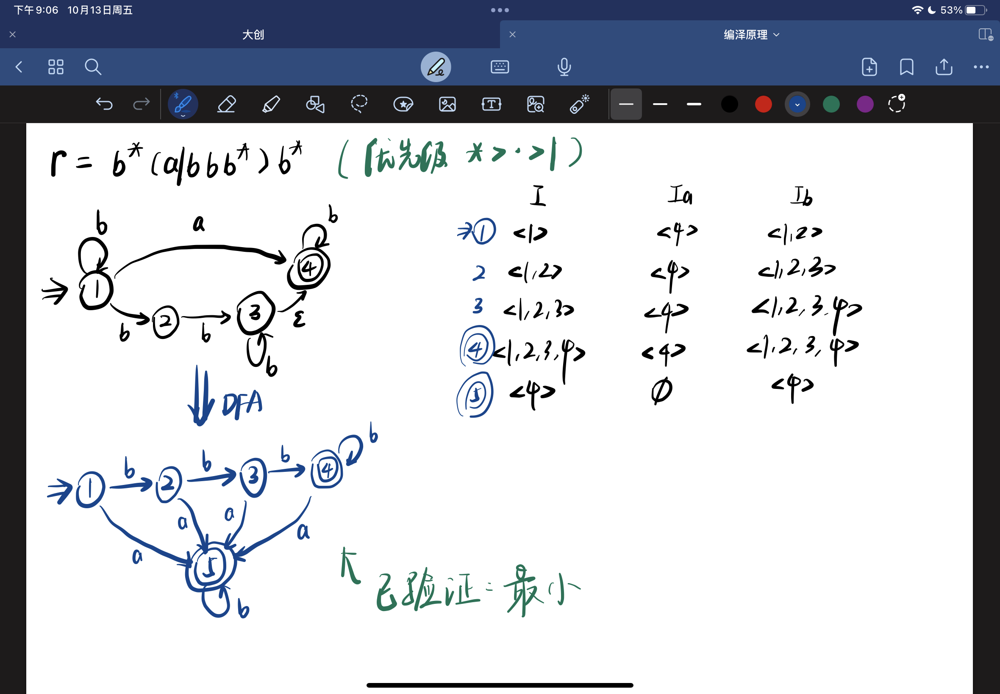
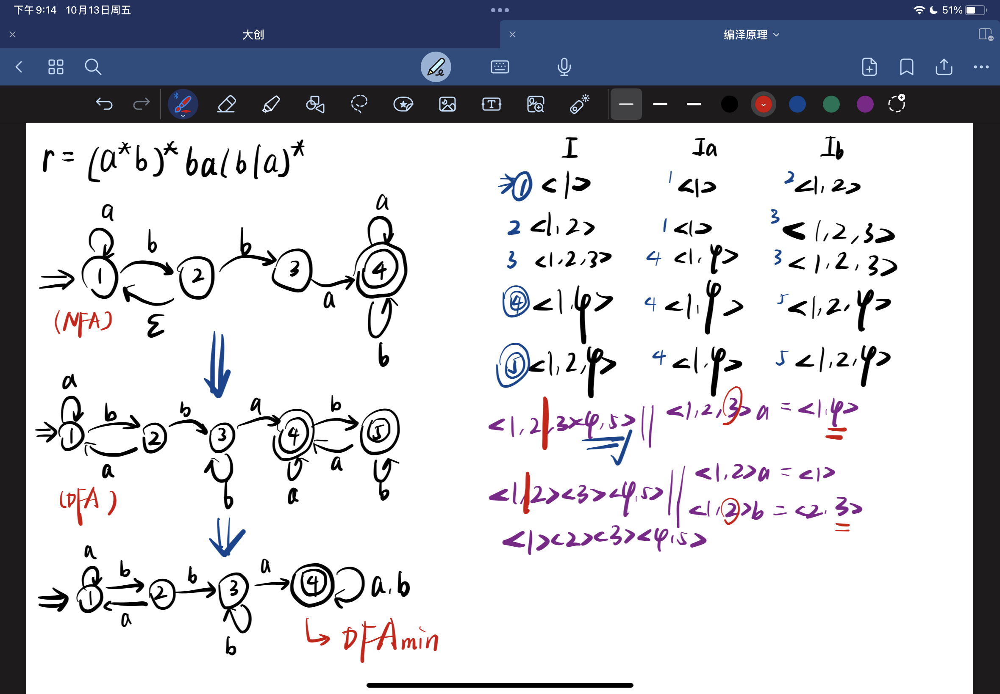
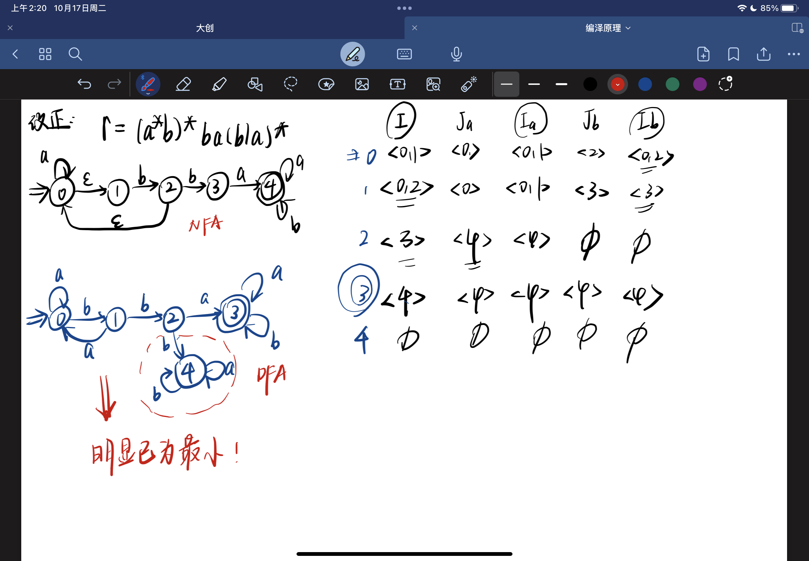
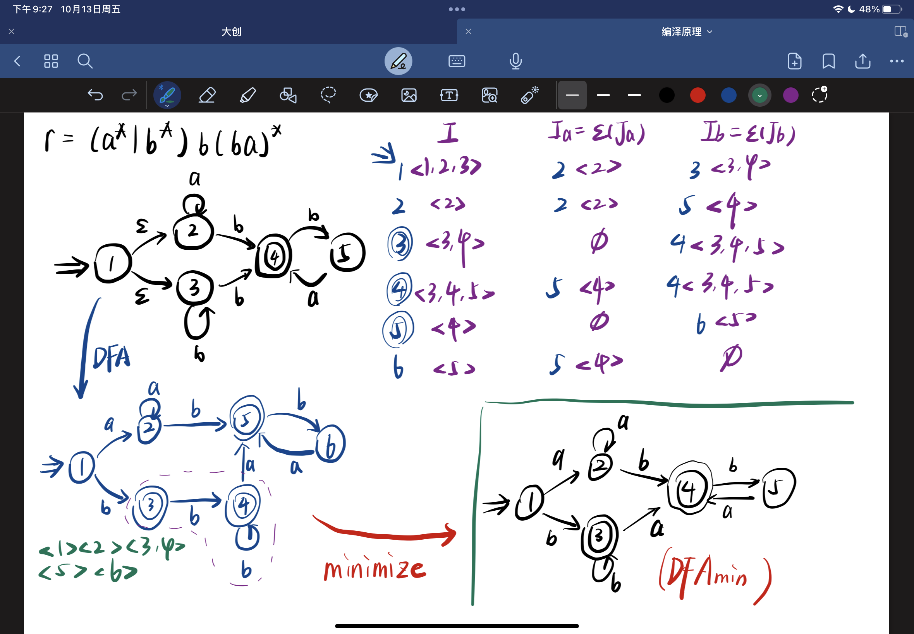
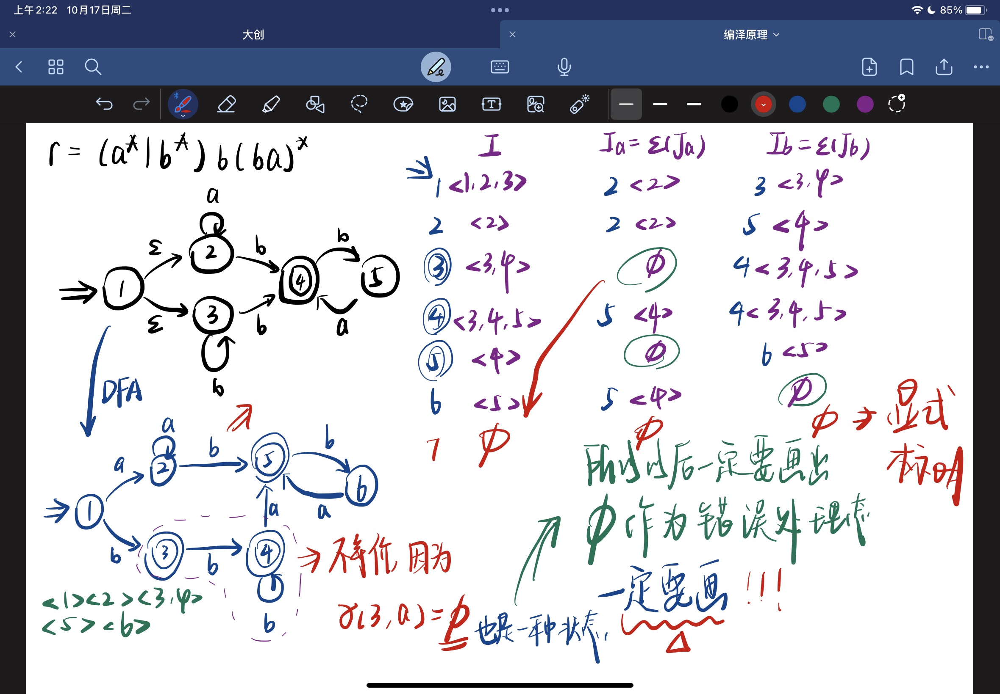
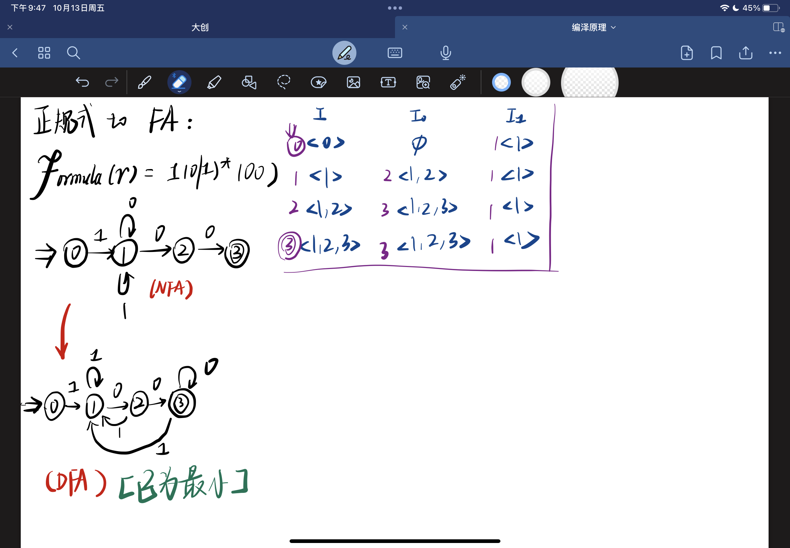
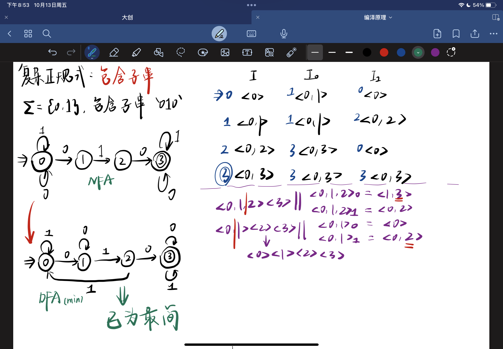
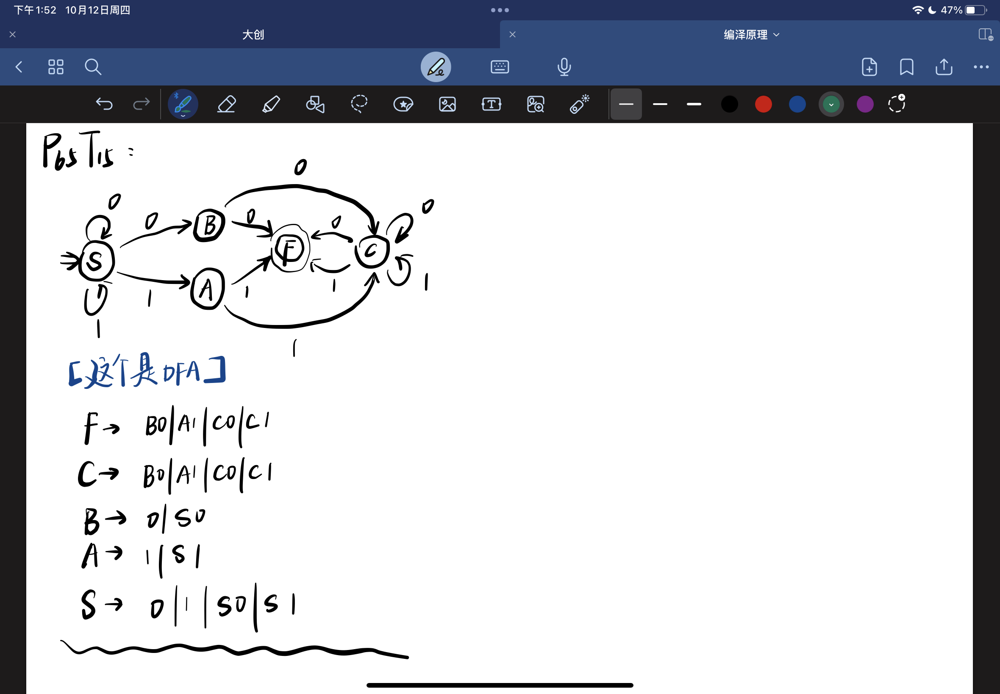
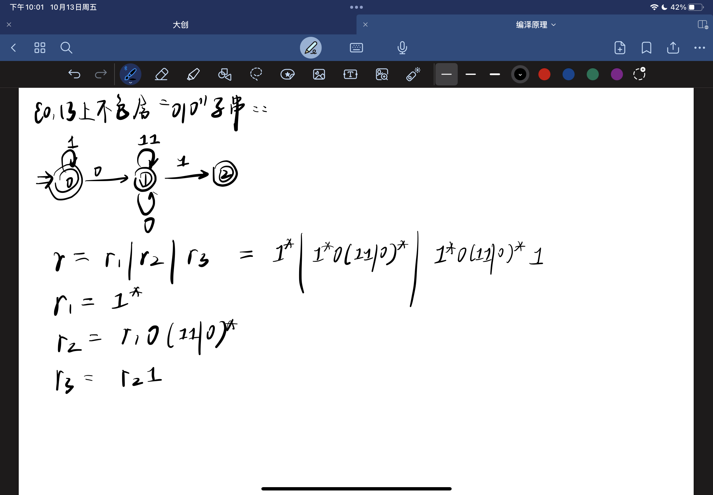
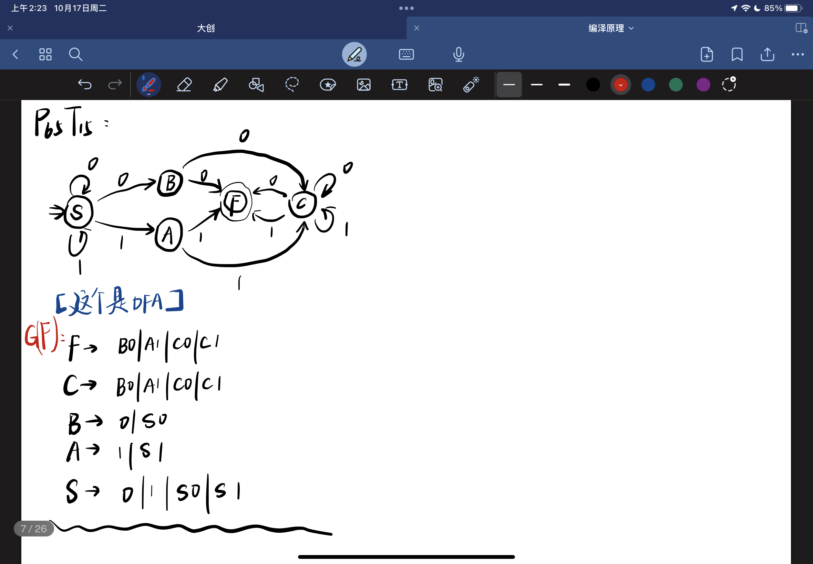

# Chapter 3

## 讨论

### 0.1

> 请简要说明自动机的用途

自动机, 是一种 `计算模型`, 用于描述 `有限状态` 的 `计算过程`. 可以通过这种模型, `抽象化/规范化/形式化` 的 `描述, 识别, 分析` 编程语言中的 `词法 & 结构`

### 0.2

> 为什么文法定义一个名字时, 产生式左边的文法符号只要能用 ->, 而不能用 = 呢?

因为 `=` 在 `编程语言` 中, 通常用于 `赋值/等值比较`, 为了避免混淆, 所以 `文法` 中使用 `->`

实际上 `->` 表示 `右值由左值推出`, `=` 在 `赋值` 语义下表示 `左值由右值得到` (更接近 `<-`), `=` 在 `比较` 语义下表示 `左值相当于右值` (由于不存在 `推出/得到` 的逻辑关系, 故更接近于 `<->`)

### 0.3

> 已知正规式 r1 和 r2，请问如何证明 r1 和 r2 是否等价?

先用 `Thompson 算法`, 将两个 `正规式` 分别转化为 `有限自动机` fa1 & fa2, 再将两个有限自动机 `确定化` 为 dfa1 & dfa2, 最后将 dfa1 & dfa2 `化简`, 如果可以得到 `相同的` 最小确定有限自动机, 那么两个正规式就是 `完全等价的`

## 作业

### 1.1

> 已知正规式:

$$
r=b^*(a|bbb^*)b^*
$$

> 给出与之等价的最小 `DFA` M

### 1.2

> 已知正规式:

$$
r=(a^*b)^*ba(b|a)^*
$$

> 给出与之等价的最小 `DFA` M

### 1.2 错误答案

### 1.2 正确答案

### 1.3

> 已知正规式:

$$
r=(a^*|b^*)b(ba)^*
$$

> 给出与之等价的最小 `DFA` M

### 1.3 错误答案

最开始的 `NFA` 的第一个节点有问题, 表示的是 (其实也不对)

$$
(b|a)^*bba(b|a)^*
$$

### 1.3 正确答案

细节! 注意细节!

### 1.4

> 现在已知一个语言 `L`, 它具有以下的特征:

$$ E = \Set{0,1} $$

> `L` 由 `E` 构成, 是一个 `值能被 4 整除` 的, 开头不为 `0` 的, 二进制数字串
>
> 现在请列出:
>
> 1. `L` 的 `正规式`
> 2. `L` 等价的 `最小确定有限自动机`

对于 `复合问题`, 一定要 `分解成原子问题` 分别考虑

1. 值可以被 `4` 整除 :: 必须以 `00` 结尾, 证明略, 凡是结尾为 `00` 的二进制串, 值 `>=4` 必然成立, 且一定都是 `4` 的倍数
2. 开头不为 `0` 的 `二进制子串` :: `1(0|1)*`

因此, 我们可以得出:

- `L` 的 `正规式`:

$$
Formal(r): r = 1(0|1)^*00
$$

- `L` 等价的 `最小确定有限自动机`:

### 1.5

> 对于 `{0, 1}` 上包含子串 `010` 的所有数字串, 列出:
>
> 1. 它的正规式
> 2. 它的最小确定有限自动机

`包含特定子串`, 一般来说, 构造难度低于 `不包含特定子串` (尤其是本题这种仅限定一种 `模式` 的情况)

对于

$$
\Sigma=\set{a_m, \dots, a_n}
$$

这样的字母表, 不限定模式, 能够构造出的 `规模最大` 的 `正规式` 的描述如下:

$$
Formal(r) : r = (a_m|a_{m+1}|\dots|a_{n-1}|a_n)^*
$$

按照这个结论, 可以得出 `(0|1)*` 是 `{0, 1}` 不限定模式时, 产生的 `规模最大` 的 `正规式`

限定 `单一` 子串, 只需要将 `指定子串` 两侧用 `规模最大的正规式` 包裹即可, 因此得出:

- 它的正规式:

$$
Formal(r): r = (0|1)^*010(0|1)^*
$$

- 它的最小确定有限自动机:

### 1.6 (着重复习, 文法与 DFA 之间的互相转换)

> 给定了一个右线性文法 `G`:

$$
\begin{align}
G(S) :\
S &\rightarrow 0S|1S|1A|0B \\
A &\rightarrow 1C|1 \\
B &\rightarrow 0C|0 \\
C &\rightarrow 0C|1C|0|1
\end{align}
$$

> 求出与它等价的一个 `左线性文法`

想要解决这个问题, 只要根据 `G` 构造 `DFA`, 再根据 `DFA` 构造 `G_L` (左线性文法) 即可

结论:

#### 注意: 这里一定要写 G_L(F) 就像前面写 G(S) 一样, 标记文法的起始符号

$$
G(S) \leftrightarrows G_L(F) : \ \ \begin{align}
F &\rightarrow B0|A1|C0|C1 \\
C &\rightarrow B0|A1|C0|C1 \\
B &\rightarrow 0|S0 \\
A &\rightarrow 1|S1 \\
S &\rightarrow 0|1|S0|S1
\end{align}
$$

细节:

## 拓展

### 2.1

> 对于 `{0, 1}` 上 `不包含` 子串 `010` 的所有数字串, 列出:
>
> 1. 它的正规式
> 2. 它的最小确定有限自动机

`不包含` 子串问题, 考虑的出发点 (初态), 一定是 `字母表` 中 `不同于` 给定子串 `开头字母` 的 `元素`

格外注意, `不包含` 子串, 隐含 `长度不限`, 因此完全有可能允许: 多个 `单字符` 结尾的情况

分析本题:

### 2.1 不规范分析

### 2.1 规范分析

