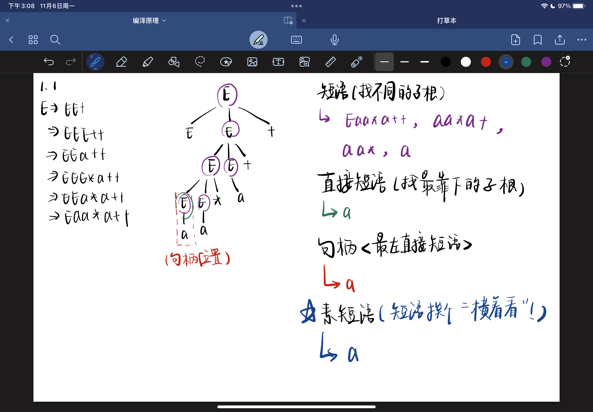
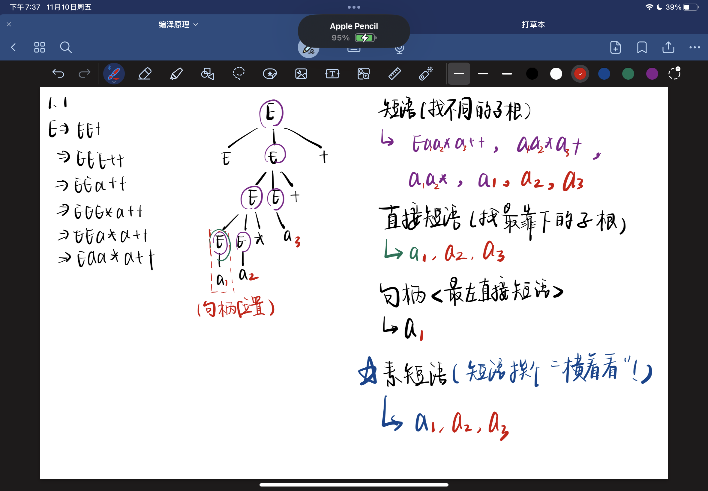
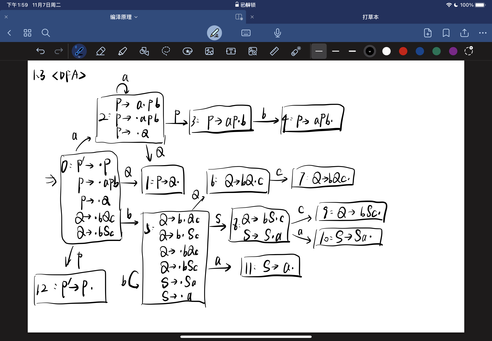
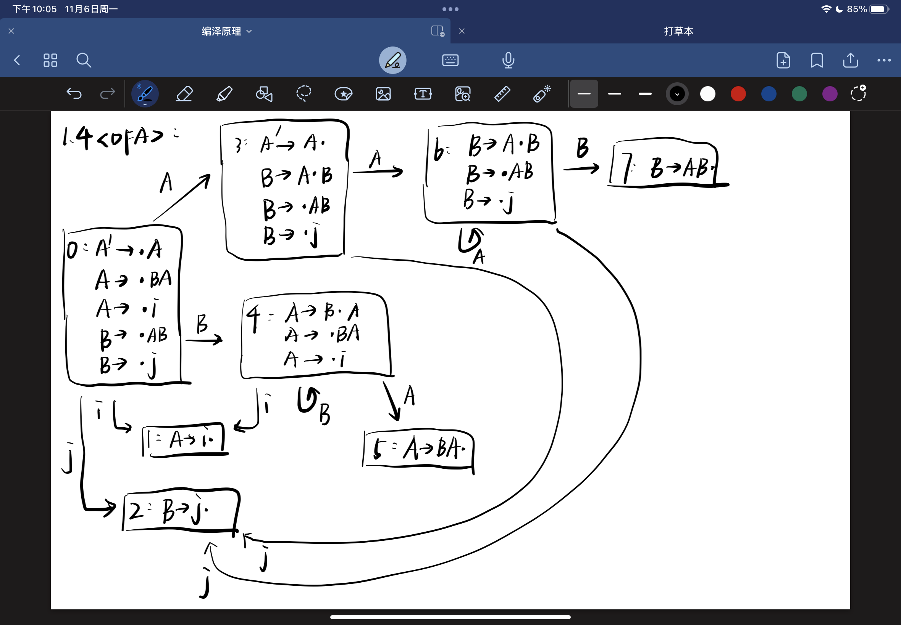
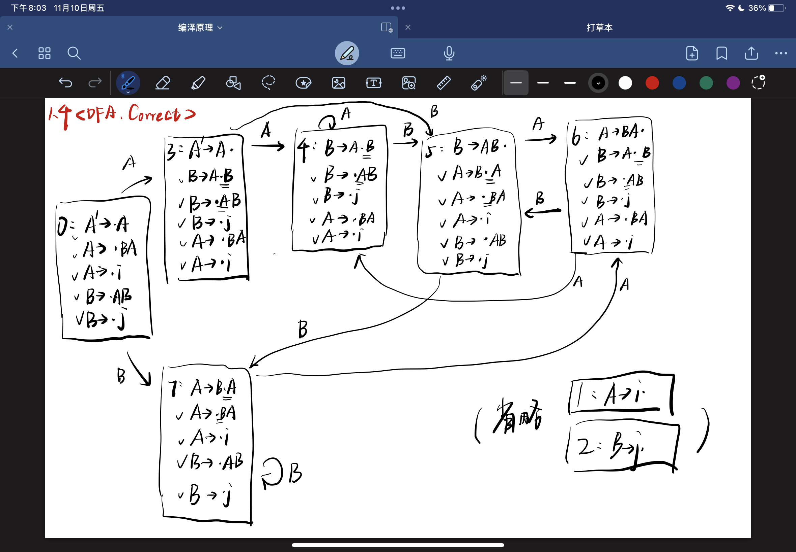
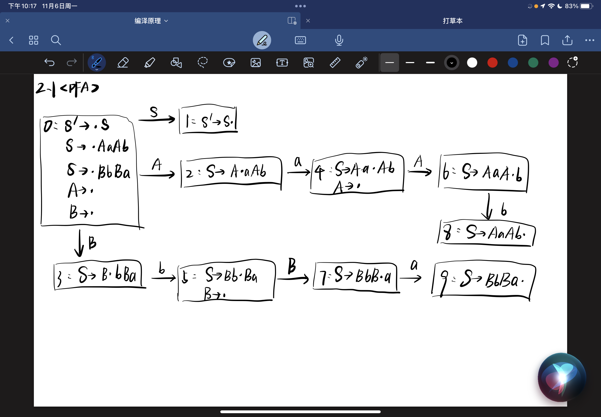

# Chapter 5 (这一部分着重复习)

## 作业

### 1.1 (着重复习: 这几种定义)

> 已知文法

$$
\begin{align*}
G(E): E\to EE*|EE+|a
\end{align*}
$$

> 1. 给出符号串 `Eaa*a++` 的最右推导
> 2. 给出该句型的语法分析树
> 3. 给出其所有的 `短语`, `直接短语`, `句柄`, `素短语`

最右推导:

$$
\begin{align*}
E
&\Rightarrow EE+ \\
&\Rightarrow EEE++ \\
&\Rightarrow EEa++ \\
&\Rightarrow EEE*a++ \\
&\Rightarrow EEa*a++ \\
&\Rightarrow Eaa*a++ \\
\end{align*}
$$

语法分析树:

`短语`, `直接短语`, `句柄`, `素短语`:

- 短语(遍历所有子根): $~~\text{Eaa*a++, aa*a+, aa*, a}$
- 直接短语(遍历最靠下的子根): $~~\text{a}$
- 句柄(最左直接短语): $~~\text{a}$
- 素短语(短语里面, 终结符含量最少(不为零)): $~~\text{a}$

#### 1.1 错因

对于 `出现在不同位置` 的 `相同符号`, 用下标区分

#### 1.1 修正

- 短语(遍历所有子根): $~~ Ea_1a_2*a_3++, a_1a_2*a_3+, a_1a_2*, a_1, a_2, a_3$
- 直接短语(遍历最靠下的子根): $~~ a_1, a_2, a_3$
- 句柄(最左直接短语): $~~ a_1$
- 素短语(短语里面, 终结符含量最少(不为零)): $~~ a_1, a_2, a_3$

### 1.2 (着重复习: FirstVT, LastVT, 优先关系表)

> 已知文法

$$
\begin{align*}
G(S): S&\to(A)|a \\
A&\to A+S|S
\end{align*}
$$

> 1. 构造各非终结符的 $FirstVT$ 集合和 $LastVT$ 集合
> 2. 构造优先关系表

$FirstVT$ 和 $LastVT$ 集合, 遵循 `右边的` 加到 `左边的` 原则

| $V_N$ |    $FirstVT$    |    $LastVT$     |
| :---: | :-------------: | :-------------: |
|  $S$  |  $\set{(, a}$   |  $\set{), a}$   |
|  $A$  | $\set{+, (, a}$ | $\set{+, ), a}$ |

处理 $A$ 的两个集合, 先从产生式直接看出的 `非终结符` 入手 (`+`)

于是, 可以构造优先关系表

构造过程中, 依次分析:

$$
\begin{align*}
S&\to(A) \\
S&\to a \\
A&\to A+S \\
A&\to S \\
&(\# S \#) ~~\dots~~ (\# \in V_T)
\end{align*}
$$

|      |    $($     |    $a$     |    $)$    |    $+$     |   $\#$    |
| :--: | :--------: | :--------: | :-------: | :--------: | :-------: |
| $($  | $\lessdot$ | $\lessdot$ | $\eqcirc$ | $\lessdot$ |           |
| $a$  |            |            | $\gtrdot$ | $\gtrdot$  | $\gtrdot$ |
| $)$  |            |            | $\gtrdot$ | $\gtrdot$  | $\gtrdot$ |
| $+$  | $\lessdot$ | $\lessdot$ | $\gtrdot$ | $\gtrdot$  |           |
| $\#$ | $\lessdot$ | $\lessdot$ |           |            | $\eqcirc$ |

### 1.3

> 已知文法

$$
\begin{align*}
G(P): P&\to aPb|Q \\
Q&\to bQc|bSc \\
S&\to Sa|a
\end{align*}
$$

> 1. 构造识别其文法 `所有活前缀` 的 $DFA(M)$
> 2. 构造其 SLR 分析表，判断 `G(P)` 是否为 `SLR(1)`文法

枚举所有的项目, 并编号:

$$
\begin{align*}
P'&\to \cdot P \\
P'&\to P \cdot \\
P&\to \cdot aPb \\
P&\to a\cdot Pb \\
P&\to aP\cdot b \\
P&\to aPb \cdot \\
P&\to \cdot Q \\
P&\to Q\cdot \\
Q&\to \cdot bQc \\
Q&\to b\cdot Qc \\
Q&\to bQ\cdot c \\
Q&\to bQc\cdot \\
Q&\to \cdot bSc \\
Q&\to b\cdot Sc \\
Q&\to bS\cdot c \\
Q&\to bSc\cdot \\
S&\to \cdot Sa \\
S&\to S\cdot a \\
S&\to Sa\cdot \\
S&\to \cdot a \\
S&\to a\cdot
\end{align*}
$$

列出 $G(P')$:

$$
\begin{align}
G(P'): P'&\to P \tag{0} \\
P&\to aPb \tag{1} \\
P&\to Q \tag{2} \\
Q&\to bQc \tag{3} \\
Q&\to bSc \tag{4} \\
S&\to Sa \tag{5} \\
S&\to a \tag{6}
\end{align}
$$

求出 $Follow$ 集:

| $V_N$ |      $Follow$       |
| :---: | :-----------------: |
| $P'$  |     $\set{\#}$      |
|  $P$  |    $\set{\#, b}$    |
|  $Q$  |  $\set{\#, b, c}$   |
|  $S$  | $\set{\#, a, b, c}$ |

随后, 即可构造 $DFA(M)$:

然后构造 `SLR 分析表`:

| State | Action |     |     |     | Goto |     |     |
| :---: | :----: | :-: | :-: | :-: | :--: | :-: | :-: |
|       |   a    |  b  |  c  |  #  |  P   |  Q  |  S  |
|   0   |   s2   | s5  |     |     |  12  |  1  |     |
|   1   |        | r2  |     | r2  |      |     |     |
|   2   |   s2   |     |     |     |  3   |  1  |     |
|   3   |        | s4  |     |     |      |     |     |
|   4   |        | r1  |     | r1  |      |     |     |
|   5   |  s11   | s5  |     |     |      |  6  |  8  |
|   6   |        |     | s7  |     |      |     |     |
|   7   |        | r3  | r3  | r3  |      |     |     |
|   8   |   s9   | s10 |     |     |      |     |     |
|   9   |        | r4  | r4  | r4  |      |     |     |
|  10   |   r5   | r5  | r5  | r5  |      |     |     |
|  11   |   r6   | r6  | r6  | r6  |      |     |     |
|  12   |        |     |     | acc |      |     |     |

很显然的, 这张 $SLR$ 分析表 `不存在` 包含 `多重定义` 的 `入口`, 不含有 `动作冲突`, 所以说这就是 `SLR(1)` 文法

#### 1.3 错因

$Follow(S)$ 求错了, 不小心把 $Follow(Q)$ 加进去了

#### 1.3 修正

求出 $Follow$ 集:

| $V_N$ |     $Follow$     |
| :---: | :--------------: |
| $P'$  |    $\set{\#}$    |
|  $P$  |  $\set{\#, b}$   |
|  $Q$  | $\set{\#, b, c}$ |
|  $S$  |   $\set{a, c}$   |

$SLR$ 分析表中, 只需要针对 `State 10 & 11` 进行修正即可

| State | Action |     |     |     | Goto |     |     |
| :---: | :----: | :-: | :-: | :-: | :--: | :-: | :-: |
|       |   a    |  b  |  c  |  #  |  P   |  Q  |  S  |
|   0   |   s2   | s5  |     |     |  12  |  1  |     |
|   1   |        | r2  |     | r2  |      |     |     |
|   2   |   s2   |     |     |     |  3   |  1  |     |
|   3   |        | s4  |     |     |      |     |     |
|   4   |        | r1  |     | r1  |      |     |     |
|   5   |  s11   | s5  |     |     |      |  6  |  8  |
|   6   |        |     | s7  |     |      |     |     |
|   7   |        | r3  | r3  | r3  |      |     |     |
|   8   |   s9   | s10 |     |     |      |     |     |
|   9   |        | r4  | r4  | r4  |      |     |     |
|  10   |   r5   |     | r5  |     |      |     |     |
|  11   |   r6   |     | r6  |     |      |     |     |
|  12   |        |     |     | acc |      |     |     |

### 1.4

> 已知文法

$$
\begin{align*}
G(A): A&\to BA|i \\
B&\to AB|j
\end{align*}
$$

> 1. 构造识别其文法 `所有活前缀` 的 $DFA(M)$
> 2. 构造其 SLR 分析表，判断 `G(A)` 是否为 `SLR(1)`文法

首先, 枚举所有的项目, 并编号:

$$
\begin{align*}
A'&\to \cdot A \\
A'&\to A\cdot \\
A&\to \cdot BA \\
A&\to B\cdot A \\
A&\to BA\cdot \\
A&\to \cdot i \\
A&\to i\cdot \\
B&\to \cdot AB \\
B&\to A\cdot B \\
B&\to AB\cdot \\
B&\to \cdot j \\
B&\to j\cdot
\end{align*}
$$

列出 $G(A')$:

$$
\begin{align}
G(A'): A'&\to A \tag{0} \\
A&\to BA \tag{1} \\
A&\to i \tag{2} \\
B&\to AB \tag{3} \\
B&\to j \tag{4}
\end{align}
$$

求出 $Follow$ 集:

| $V_N$ |   $First$    | $Follow$         |
| :---: | :----------: | ---------------- |
| $A'$  | $\set{i, j}$ | $\set{\#}$       |
|  $A$  | $\set{i, j}$ | $\set{\#, i, j}$ |
|  $B$  | $\set{i, j}$ | $\set{i, j}$     |

随后, 即可构造 $DFA(M)$:

以及 $SLR$ 表:

| State | Action |     |     | Goto |     |
| :---: | :----: | :-: | :-: | :--: | :-: |
|       |   i    |  j  |  #  |  A   |  B  |
|   0   |   s1   | s2  |     |  3   |  4  |
|   1   |   r2   | r2  | r2  |      |     |
|   2   |   r4   | r4  |     |      |     |
|   3   |        | s2  | acc |  6   |     |
|   4   |   s1   |     |     |  5   |  4  |
|   5   |   r1   | r1  | r1  |      |     |
|   6   |        | s2  |     |  6   |  7  |
|   7   |   r3   | r3  |     |      |     |

很显然的, 这张 $SLR$ 分析表 `不存在` 包含 `多重定义` 的 `入口`, 不含有 `动作冲突`, 所以说这就是 `SLR(1)` 文法

#### 1.4 错因

状态 `3, 4, 6` 的 `CLOSURE` 没有求全

#### 1.4 修正

| State | Action |        |     | Goto |     |
| :---: | :----: | :----: | :-: | :--: | :-: |
|       |   i    |   j    |  #  |  A   |  B  |
|   0   |   s1   |   s2   |     |  3   |  4  |
|   1   |   r2   |   r2   | r2  |      |     |
|   2   |   r4   |   r4   |     |      |     |
|   3   |   s1   |   s2   | acc |  4   |  5  |
|   4   |   s1   |   s2   |     |  4   |  5  |
|   5   | s1, r3 | s2, r3 |     |  6   |  7  |
|   6   | s1, r1 | s2, r1 | r1  |  4   |  5  |
|   7   |   s1   |   s2   |     |  6   |  7  |

这张 $SLR$ 分析表 `存在` 多个包含 `多重定义` 的 `入口`, 含有 `动作冲突`, 因此 **不是** `SLR(1)` 文法

### 2.1

> 课本 $P_{135}~T_{8}$
>
> (说明: 判断 `SLR(1)` 文法使用先构造 `SLR 分析表`, 根据 SLR 分析表判断)
>
> 证明下面的文法:

$$
\begin{align*}
S&\to AaAb|BbBa \\
A&\to \epsilon \\
B&\to \epsilon \\
\end{align*}
$$

> 是 $LL(1)$ 但不是 $SLR(1)$ 的

首先, 枚举所有项目, 并编号:

(一定要注意, 形如 $A\to\epsilon$ 的产生式, 有且仅有一个项目 $A\to\cdot$)

$$
\begin{align*}
S'&\to \cdot S \\
S'&\to S\cdot \\
S&\to \cdot AaAb \\
S&\to A\cdot aAb \\
S&\to Aa\cdot Ab \\
S&\to AaA\cdot b \\
S&\to AaAb\cdot \\
S&\to \cdot BbBa \\
S&\to B\cdot bBa \\
S&\to Bb\cdot Ba \\
S&\to BbB\cdot a \\
S&\to BbBa\cdot \\
A&\to \cdot \\
B&\to \cdot
\end{align*}
$$

列出 $G(S')$:

$$
\begin{align}
G(S'): S'&\to S \tag{0} \\
S&\to AaAb \tag{1} \\
S&\to BbBa \tag{2} \\
A&\to \epsilon \tag{3} \\
B&\to \epsilon \tag{4}
\end{align}
$$

求出 $Follow$ 集:

| $V_N$ |        $First$         | $Follow$     |
| :---: | :--------------------: | ------------ |
| $S'$  | $\set{\epsilon, a, b}$ | $\set{\#}$   |
|  $S$  | $\set{\epsilon, a, b}$ | $\set{\#}$   |
|  $A$  |    $\set{\epsilon}$    | $\set{a, b}$ |
|  $B$  |    $\set{\epsilon}$    | $\set{a, b}$ |

随后, 即可构造 $DFA(M)$:

这里, 对于 $I_0$ 状态中, 存在两个项目:

$$
\begin{align*}
A&\to \cdot \\
B&\to \cdot
\end{align*}
$$

按照规则, 我们需要为 $a\in Follow(A)$ 添加 `r3`, 再为 $b\in Follow(B)$ 添加 `r4`

但是, $Follow(A) = Follow(B)$, 势必造成 `多重定义`, 并不是 `SLR(1)` (**请构造出 SLR 分析表**)

接下来分析其 `LL(1)` 特征:

- [x] 不存在左递归
- [x] $ \forall A \in V_N (A \to \alpha_1 | \alpha_2 | \dots | \alpha_n) \to First(\alpha_i) \cap First(\alpha_j) = \Phi ~ (i \ne j) $
- [x] $ \forall A \in V_N (\epsilon \in First(A)) \to First(A) \cap Follow(A) = \Phi $ (该情境下, 重点关注 $A\to\epsilon~,~B\to\epsilon$)

因此, 这就是一个 `LL(1)` 文法
